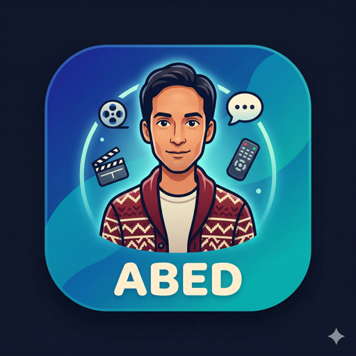

# abed

<p align="center">
  
</p>

> *"I can tell life from TV, Jeff. TV makes sense, it has logic, structure, rules, and likeable leading men. In life, we have this."* — Abed Nadir, *Community*

Named after **Abed Nadir** from the TV show [*Community*](https://en.wikipedia.org/wiki/Community_(TV_series)) — a pop-culture encyclopedia with an encyclopedic knowledge of movies and television. If anyone's going to help you decide what to watch next, it's Abed. This bot channels that same energy into your Slack workspace.

---

A Slack and Discord bot that lets users request movies and TV shows directly from chat. Users run `/movie <title>` or `/tv <title>`, the bot searches Radarr or Sonarr respectively and presents a dropdown of results. Once a user selects a title, an approval request is posted to a dedicated channel with Approve/Reject buttons. When an approver clicks Approve, the movie or TV show is automatically added to Radarr/Sonarr and the requester gets a DM confirmation. Sonarr integration is optional — the bot works with Radarr only, Sonarr only, or both. Built with [@slack/bolt](https://github.com/slackapi/bolt-js) v4 (Socket Mode) and [discord.js](https://discord.js.org/) v14. Runs on Bun, stores request history in SQLite, and deploys via Docker. You can run the Slack bot, the Discord bot, or both simultaneously!

---

## Features

- `/movie <title>` slash command that searches Radarr and returns an interactive dropdown of up to 25 results
- `/tv <title>` slash command that searches Sonarr and returns an interactive dropdown of up to 25 results
- TV show support is optional — works with movies only, TV only, or both configured
- Approval workflow with a dedicated channel and Approve/Reject buttons (shared for movies and TV shows)
- Permission-based approvals — only users listed in `APPROVER_SLACK_IDS` can approve requests
- `/myrequests [status]` slash command to view your own request history (movies and TV shows), with optional status filter
- `/queue [status]` slash command to view the server-wide request queue, with optional status filter
- Duplicate detection — skips adding a movie or TV show if it already exists in the library
- Persistent request tracking via SQLite
- Docker-deployable alongside Radarr/Sonarr on a NAS
- Socket Mode — works behind NAT with no public URL or reverse proxy required

---

## Architecture

### Movies

```
User → /movie <title>
         │
         ▼
  Bot searches Radarr API
         │
         ▼
  Dropdown of results sent ephemerally to user
         │
         ▼ (user selects a movie)
  Approval message posted to #approval-channel
  with [Approve] and [Reject] buttons
         │
         ├──► Approver clicks Approve
         │         │
         │         ▼
         │    Radarr adds movie
         │    Approval message updated → "Approved"
         │    Requester receives DM ✅
         │
         └──► Approver clicks Reject
                   │
                   ▼
              Approval message updated → "Rejected"
              Requester receives DM ❌
```

### TV Shows

```
User → /tv <title>
         │
         ▼
  Bot searches Sonarr API
         │
         ▼
  Dropdown of results sent ephemerally to user
         │
         ▼ (user selects a TV show)
  Approval message posted to #approval-channel
  with [Approve] and [Reject] buttons
  (includes network and season count)
         │
         ├──► Approver clicks Approve
         │         │
         │         ▼
         │    Sonarr adds series
         │    Approval message updated → "Approved"
         │    Requester receives DM ✅
         │
         └──► Approver clicks Reject
                   │
                   ▼
              Approval message updated → "Rejected"
              Requester receives DM ❌
```

---

## Prerequisites

- [Docker](https://docs.docker.com/get-docker/) + [Docker Compose](https://docs.docker.com/compose/)
- A Slack workspace where you have admin access to create apps OR a Discord server where you can add bots. You can run Slack, Discord, or both!
- A running [Radarr](https://radarr.video/) instance (on a NAS or elsewhere on the network)
- A running [Sonarr](https://sonarr.tv/) instance (optional — only needed for TV show requests)

---

## Slack App Setup

### 1. Create the App

1. Go to [https://api.slack.com/apps](https://api.slack.com/apps) and click **Create New App → From Scratch**
2. Name it `abed` and select your workspace
3. Click **Create App**

### 2. Enable Socket Mode

1. In the left sidebar, go to **Settings → Socket Mode**
2. Toggle **Enable Socket Mode** to ON
3. Click **Generate an app-level token** with the scope `connections:write`
4. Name it anything (e.g. `socket-token`) and click **Generate**
5. Copy the token — it starts with `xapp-`. Save it as `SLACK_APP_TOKEN`

### 3. Add Bot Token Scopes

1. Go to **OAuth & Permissions** in the left sidebar
2. Under **Bot Token Scopes**, add the following scopes:
   - `chat:write`
   - `commands`
   - `im:write`

### 4. Create the Slash Commands

1. Go to **Slash Commands → Create New Command**
2. Fill in:
   - **Command**: `/movie`
   - **Request URL**: any URL (e.g. `https://example.com`) — Socket Mode ignores it
   - **Short Description**: `Request a movie`
3. Click **Save**
4. If you plan to use Sonarr for TV show requests, create a second command:
   - **Command**: `/tv`
   - **Request URL**: any URL (e.g. `https://example.com`) — Socket Mode ignores it
   - **Short Description**: `Request a TV show`
5. Click **Save**
6. Create the `/myrequests` command:
   - **Command**: `/myrequests`
   - **Request URL**: any URL (e.g. `https://example.com`) — Socket Mode ignores it
   - **Short Description**: `View your requests`
   - **Usage Hint**: `[pending | approved | rejected | already_exists | failed]`
7. Click **Save**
8. Create the `/queue` command:
   - **Command**: `/queue`
   - **Request URL**: any URL (e.g. `https://example.com`) — Socket Mode ignores it
   - **Short Description**: `View the request queue`
   - **Usage Hint**: `[pending | approved | rejected | already_exists | failed]`
9. Click **Save**

### 5. Enable Interactivity

1. Go to **Interactivity & Shortcuts**
2. Toggle **Interactivity** to ON
3. Set the **Request URL** to any URL (e.g. `https://example.com`) — Socket Mode ignores it
4. Click **Save Changes**

### 6. Install to Workspace

1. Go to **OAuth & Permissions → Install to Workspace**
2. Click **Allow**
3. Copy the **Bot User OAuth Token** — it starts with `xoxb-`. Save it as `SLACK_BOT_TOKEN`

### 7. Get Channel IDs

Right-click any channel in Slack → **View channel details** → scroll down to copy the **Channel ID** (starts with `C`). You'll need this for `SLACK_REQUEST_CHANNEL_ID` and `SLACK_APPROVAL_CHANNEL_ID`.

---

## Discord App Setup

### 1. Create the App
1. Go to the [Discord Developer Portal](https://discord.com/developers/applications) and click **New Application**.
2. Name it `abed` and click **Create**.
3. Under **Installation**, configure the default install settings or simply use the **OAuth2** tab to generate a URL.

### 2. Configure the Bot
1. Go to the **Bot** tab.
2. Under **Privileged Gateway Intents**, turn on **Message Content Intent** (optional but recommended for future features).
3. Click **Reset Token** and copy your **Bot Token**. Save it as `DISCORD_BOT_TOKEN`.

### 3. Get the Client ID
1. Go to the **OAuth2** tab.
2. Copy the **Client ID**. Save it as `DISCORD_CLIENT_ID`.

### 4. Invite the Bot
1. In the **OAuth2** -> **URL Generator** tab, select the following scopes:
   - `bot`
   - `applications.commands`
2. Select the following Bot Permissions:
   - `Send Messages`
   - `Embed Links`
   - `Use Slash Commands`
3. Copy the generated URL and paste it into your browser to invite the bot to your server.

### 5. Get IDs (Server, Channel, Approver)
1. In Discord, go to **User Settings -> Advanced** and turn on **Developer Mode**.
2. Right-click your server icon and click **Copy Server ID**. Save as `DISCORD_GUILD_ID`.
3. Right-click the channel where users will make requests and click **Copy Channel ID**. Save as `DISCORD_REQUEST_CHANNEL_ID`.
4. Right-click the channel where approvals should go and click **Copy Channel ID**. Save as `DISCORD_APPROVAL_CHANNEL_ID`.
5. Right-click your own username (or any approver's username) and click **Copy User ID**. Save as `APPROVER_DISCORD_IDS` (comma-separated for multiple).

---

## Environment Variables

Copy `.env.example` to `.env` and fill in each value:

```bash
cp .env.example .env
```

| Variable | Required | Description | Example |
|---|---|---|---|
| `SLACK_BOT_TOKEN` | No** | Bot User OAuth Token | `xoxb-...` |
| `SLACK_APP_TOKEN` | No** | App-Level Token (Socket Mode) | `xapp-...` |
| `SLACK_REQUEST_CHANNEL_ID` | No** | Channel where users make requests | `C0123456789` |
| `SLACK_APPROVAL_CHANNEL_ID` | No** | Channel where approval messages appear | `C9876543210` |
| `APPROVER_SLACK_IDS` | No** | Comma-separated Slack user IDs allowed to approve | `U123ABC,U456DEF` |
| `DISCORD_BOT_TOKEN` | No** | Discord Bot Token | `MTA...` |
| `DISCORD_CLIENT_ID` | No** | Discord Client ID | `123456789...` |
| `DISCORD_GUILD_ID` | No** | Discord Server (Guild) ID | `987654321...` |
| `DISCORD_REQUEST_CHANNEL_ID` | No** | Discord channel for making requests | `111222333...` |
| `DISCORD_APPROVAL_CHANNEL_ID` | No** | Discord channel for approvals | `444555666...` |
| `APPROVER_DISCORD_IDS` | No** | Comma-separated Discord IDs | `888999000` |
| `RADARR_URL` | Yes | Radarr base URL | `http://192.168.1.100:7878` |
| `RADARR_API_KEY` | Yes | Radarr API key | `abc123...` |
| `RADARR_QUALITY_PROFILE_ID` | Yes | Numeric ID of the Radarr quality profile to use | `4` |
| `RADARR_ROOT_FOLDER_PATH` | Yes | Root folder path configured in Radarr | `/movies` |
| `DB_PATH` | No | SQLite DB file path (default: `./data/requests.db`) | `/app/data/requests.db` |
| `SONARR_URL` | No* | Sonarr base URL | `http://192.168.1.100:8989` |
| `SONARR_API_KEY` | No* | Sonarr API key | `abc123...` |
| `SONARR_QUALITY_PROFILE_ID` | No* | Numeric ID of the Sonarr quality profile to use | `1` |
| `SONARR_ROOT_FOLDER_PATH` | No* | Root folder path configured in Sonarr | `/tv` |

\*\* You must provide either all the Slack variables, all the Discord variables, or both sets. The bot will initialize whichever platforms are configured.

*Sonarr variables are optional but all-or-none — set all four to enable TV show requests, or omit all four to disable them. Setting only some will cause a startup error.

---

## Radarr Setup

### Get Your API Key

In Radarr, go to **Settings → General → Security → API Key** and copy it.

### Get Your Quality Profile ID

Visit the following URL in a browser (replace with your Radarr URL and API key):

```
http://<radarr-url>/api/v3/qualityProfile?apikey=<your-api-key>
```

This returns a JSON array of quality profiles. Find the profile you want and note its `id` field. Use that as `RADARR_QUALITY_PROFILE_ID`.

### Get Your Root Folder Path

```
http://<radarr-url>/api/v3/rootFolder?apikey=<your-api-key>
```

Note the `path` field of your desired root folder (e.g. `/movies`). Use that as `RADARR_ROOT_FOLDER_PATH`.

### Find Approver Slack User IDs

In Slack, click on a user's profile → click the **⋮** (More) menu → **Copy member ID**. The ID starts with `U`. Add one or more (comma-separated) to `APPROVER_SLACK_IDS`.

---

## Sonarr Setup (Optional)

Skip this section if you don't plan to use TV show requests.

### Get Your API Key

In Sonarr, go to **Settings → General → Security → API Key** and copy it.

### Get Your Quality Profile ID

Visit the following URL in a browser (replace with your Sonarr URL and API key):

```
http://<sonarr-url>/api/v3/qualityprofile?apikey=<your-api-key>
```

This returns a JSON array of quality profiles. Find the profile you want and note its `id` field. Use that as `SONARR_QUALITY_PROFILE_ID`.

> **Note:** Sonarr uses lowercase `qualityprofile` and `rootfolder` in its API paths, unlike Radarr which uses `qualityProfile` and `rootFolder`.

### Get Your Root Folder Path

```
http://<sonarr-url>/api/v3/rootfolder?apikey=<your-api-key>
```

Note the `path` field of your desired root folder (e.g. `/tv`). Use that as `SONARR_ROOT_FOLDER_PATH`.

---

## Docker Deployment on NAS

```bash
# 1. Clone the repo
git clone <repo-url>
cd abed

# 2. Create your .env file
cp .env.example .env
# Edit .env with your actual values

# 3. Create the Docker network (if it doesn't exist)
docker network create media

# 4. Start the bot
docker compose up -d

# 5. Check logs
docker compose logs -f abed
```

> **Note on networking:** The `docker-compose.yml` attaches the bot to a `media` external Docker network. This is the same network Radarr and Sonarr should be running on, allowing the bot to reach them by container name (e.g. `http://radarr:7878` or `http://sonarr:8989`). If they are **not** on the same Docker network, set `RADARR_URL` / `SONARR_URL` to the host machine's LAN IP address instead (e.g. `http://192.168.1.100:7878`). Do **not** use `localhost` — inside a container, `localhost` refers to the container itself.

> **Data persistence:** The `./data` directory on the host is mounted to `/app/data` inside the container. This is where SQLite stores the requests database. Make sure `./data` exists and is writable on the host before starting.

---

## Unraid Deployment

The bot can be installed on Unraid via the Docker UI using the included XML template.

### Quick Install

1. In the Unraid web UI, go to **Docker → Add Container → Template Repositories**
2. Add the template URL: `https://github.com/gugahoi/abed/tree/main/unraid`
3. Click **Save**, then select **abed** from the template dropdown
4. Fill in the required fields (Slack tokens, Radarr URL, API key, etc.)
5. Click **Apply**

Alternatively, you can pull the image manually:

```
Repository: ghcr.io/gugahoi/abed:latest
```

### Networking

The template uses **bridge** network mode by default. Since the bot communicates with Radarr/Sonarr via HTTP, set `RADARR_URL` and `SONARR_URL` to your server's LAN IP (e.g. `http://192.168.1.100:7878`). Do **not** use `localhost` — inside a container, `localhost` refers to the container itself.

If Radarr/Sonarr are on a custom Docker network (e.g. `media`), you can switch the container's network mode to that network and use container names instead (e.g. `http://radarr:7878`).

No ports need to be mapped — the bot uses Slack's Socket Mode (outbound WebSocket only).

### Permissions (PUID/PGID)

The container supports configurable user/group IDs via `PUID` and `PGID` environment variables. The template defaults to Unraid's standard `99:100` (`nobody:users`). Adjust these if your appdata directory uses different ownership.

### Data

The SQLite database is stored at `/app/data/requests.db` inside the container. The template maps this to `/mnt/user/appdata/abed` on the host by default.

---

## Local Development

```bash
# Install Bun (if not already installed)
curl -fsSL https://bun.sh/install | bash

# Install dependencies
bun install

# Copy and fill in env vars
cp .env.example .env

# Run in development mode (auto-reload on file changes)
bun run dev

# Run tests
bun test

# Type check
bun run typecheck
```

---

## How It Works

### Movies

1. **User types `/movie The Batman`** in any channel
2. **Bot searches Radarr** and responds ephemerally (visible only to the user) with a dropdown of up to 25 matching results
3. **User selects a movie** from the dropdown
4. **Bot posts an approval request** to the `SLACK_APPROVAL_CHANNEL_ID` channel, including movie details and **Approve** / **Reject** buttons
5. **An approver** (a user whose Slack ID is listed in `APPROVER_SLACK_IDS`) clicks **Approve**
6. **Bot calls the Radarr API** to add the movie using the configured quality profile and root folder path
7. **Approval message is updated** to show "Approved ✅" and the requester receives a DM confirming the movie was added
8. **If Reject is clicked instead:** the approval message is updated to show "Rejected ❌" and the requester receives a DM informing them

> **Duplicate detection:** Before adding a movie to Radarr, the bot checks whether it's already in the library. If it is, it skips the API call and notifies accordingly.

### TV Shows

1. **User types `/tv Breaking Bad`** in any channel
2. **Bot searches Sonarr** and responds ephemerally with a dropdown of matching results
3. **User selects a TV show** from the dropdown
4. **Bot posts an approval request** to the same approval channel, including show details (network, season count) and **Approve** / **Reject** buttons
5. **An approver** clicks **Approve**
6. **Bot calls the Sonarr API** to add the series using the configured quality profile and root folder path
7. **Approval message is updated** to show "Approved ✅" and the requester receives a DM confirming the show was added
8. **If Reject is clicked instead:** the approval message is updated to show "Rejected ❌" and the requester receives a DM informing them

> **Not configured:** If Sonarr is not configured (no `SONARR_*` env vars set), the `/tv` command responds with "TV show requests are not configured."

### Viewing Your Requests

1. **User types `/myrequests`** in any channel
2. **Bot queries the SQLite database** for all movie and TV requests made by that user
3. **Bot responds ephemerally** (visible only to the user) with up to 15 requests, sorted newest-first, showing title, type (movie/TV), and status

> **Optional status filter:** Users can type `/myrequests pending` (or `approved`, `rejected`, `already_exists`, `failed`) to filter results by status. If omitted, all statuses are shown.

### Viewing the Request Queue

1. **User types `/queue`** in any channel
2. **Bot queries the SQLite database** for all movie and TV requests across all users, sorted newest-first (up to 25 results)
3. **Bot responds ephemerally** (visible only to the user) with each request showing title, type (movie/TV), status, and who requested it

> **Optional status filter:** Users can type `/queue pending` (or `approved`, `rejected`, `already_exists`, `failed`) to filter results by status. If omitted, all statuses are shown.

---

## Troubleshooting

| Problem | Likely Cause | Fix |
|---|---|---|
| Bot doesn't respond to `/movie` | Wrong `SLACK_BOT_TOKEN` or Socket Mode not enabled | Verify the token starts with `xoxb-`. Check that Socket Mode is ON in the Slack app settings under **Settings → Socket Mode** |
| Bot doesn't respond to `/tv` | Sonarr not configured or `/tv` command not created | Ensure all four `SONARR_*` variables are set in `.env`. Check that the `/tv` slash command was created in the Slack app settings |
| "You are not authorized to approve" | User's Slack ID is not in `APPROVER_SLACK_IDS` | Get the user's Slack member ID (click their profile → ⋮ → Copy member ID) and add it to `APPROVER_SLACK_IDS` in `.env` |
| Movie not added to Radarr after approval | Wrong `RADARR_URL`, `RADARR_API_KEY`, or `RADARR_QUALITY_PROFILE_ID` | Test the API key: `curl "<radarr-url>/api/v3/system/status?apikey=<key>"`. Verify the quality profile ID exists at `/api/v3/qualityProfile` |
| TV show not added to Sonarr after approval | Wrong `SONARR_URL`, `SONARR_API_KEY`, or `SONARR_QUALITY_PROFILE_ID` | Test the API key: `curl "<sonarr-url>/api/v3/system/status?apikey=<key>"`. Verify the quality profile ID exists at `/api/v3/qualityprofile` |
| `/tv` says "not configured" | `SONARR_*` env vars not set | Set all four `SONARR_URL`, `SONARR_API_KEY`, `SONARR_QUALITY_PROFILE_ID`, and `SONARR_ROOT_FOLDER_PATH` in `.env` |
| Container can't reach Radarr or Sonarr | Using `localhost` for `RADARR_URL` or `SONARR_URL` | Use the host machine's LAN IP (e.g. `http://192.168.1.100:7878`), not `localhost` — containers don't share the host's localhost |
| Approval buttons do nothing | Interactivity not enabled in Slack app | Go to **Interactivity & Shortcuts** in the Slack app settings and make sure Interactivity is toggled ON (any request URL works with Socket Mode) |
| Bot doesn't respond to `/myrequests` | `/myrequests` slash command not created in Slack app | Go to **Slash Commands** in the Slack app settings and create the `/myrequests` command (see [Slack App Setup](#4-create-the-slash-commands)) |
| Bot doesn't respond to `/queue` | `/queue` slash command not created in Slack app | Go to **Slash Commands** in the Slack app settings and create the `/queue` command (see [Slack App Setup](#4-create-the-slash-commands)) |
| SQLite errors or data not persisting between restarts | Volume not mounted or `./data` directory not writable | Ensure the `./data:/app/data` volume binding is in `docker-compose.yml` and that `./data` exists and is writable on the host |
